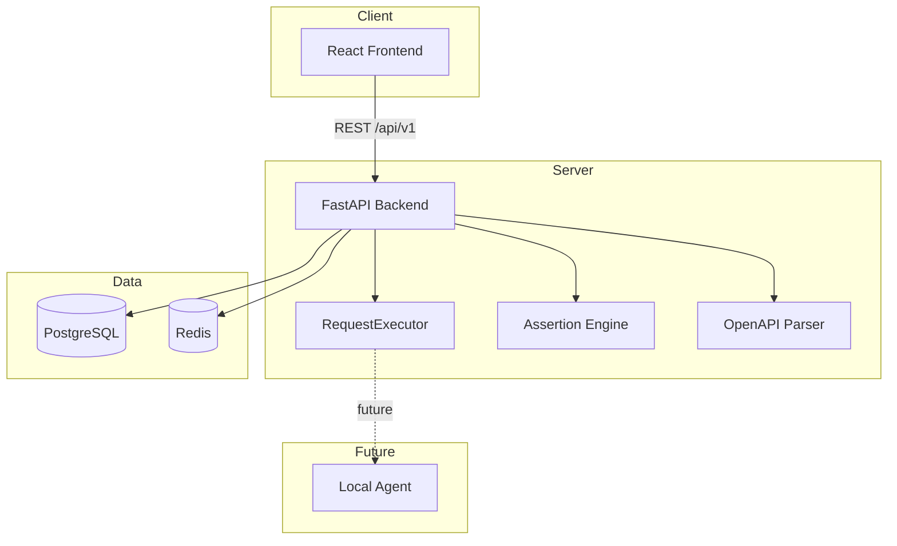

# Architecture Documentation

## Overview

ReqLab follows a classic three-tier architecture with clear separation between frontend, backend API, and data layers. A pluggable execution layer prepares for future Local Agent integration.



## Frontend Architecture

| Concern | Technology |
|---------|-----------|
| UI | React 18 + TypeScript |
| Build | Vite |
| Styling | TailwindCSS |
| Server State | React Query |
| Client State | Zustand (auth, request builder) |
| Routing | React Router v7 |

### Key Pages

- **Dashboard** — Stats and recent activity
- **Collections** — Tree view + embedded request builder
- **Request Builder** — Standalone quick testing
- **Environments** — Variable management
- **History** — Execution log
- **OpenAPI Import** — Spec-to-collection conversion

## Backend Architecture

```
backend/app/
├── api/v1/          # HTTP route handlers
├── core/            # Config, security, database, dependencies
├── models/          # SQLAlchemy ORM models
├── schemas/         # Pydantic request/response models
└── services/      # Business logic (executor, assertions, OpenAPI)
```

### Request Execution Flow

1. Client sends `POST /api/v1/execute` with request config
2. Backend resolves environment variables (global → collection → selected)
3. `RequestExecutor.execute()` runs the HTTP call
4. `AssertionEngine` evaluates stored assertions
5. Result saved to `history` table
6. Response returned to client

### Security

- JWT access tokens (30 min) + refresh tokens (7 days)
- bcrypt password hashing
- Pydantic input validation on all endpoints
- CORS middleware configuration
- Rate limiting architecture ready (`RATE_LIMIT_ENABLED` flag)

## Database Schema

```
users
  └── collections
        ├── folders (self-referential parent_id)
        ├── requests
        │     └── assertions
        ├── environments
        └── openapi_imports
history (links user, optional request/collection)
```

All foreign keys use appropriate `ON DELETE` cascades. Indexes on frequently queried columns (`owner_id`, `collection_id`, `created_at`).

## Local Agent (Future)

The `RequestExecutor` abstraction decouples *where* HTTP runs from *how* requests are configured:

| Executor | Use Case |
|----------|----------|
| `ServerRequestExecutor` | Public APIs (current) |
| `LocalAgentRequestExecutor` | localhost, VPN, private networks |

The agent will implement the same interface: `execute()`, `validate()`, `cancel()`.

## Extensibility Points

| Feature | Extension Point |
|---------|----------------|
| Load testing | **Not implemented** — planned as new executor + scheduler service |
| GraphQL | New request type + dedicated executor |
| gRPC | Proto parser + grpc executor |
| SOAP | WSDL parser + XML executor |
| Collaboration | User teams, shared collections (schema ready) |
| AI testing | Assertion suggestion service |

## Screenshots


